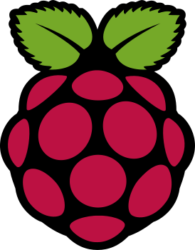

## 📬 Find me at

[
)](https://x.com/FarivarTB)

## 👨🏼‍💻 A little about me

- I'm a passionate and self-driven software developer with 3 years of professional experience and over 5 years of hands-on programming. I specialize in backend development and system design, with solid expertise in Python and intermediate skills in C#, currently expanding into Rust, embedded systems, and low-level programming.

- Currently, I'm building my own startup ([Snacksy](https://github.com/Hyperion-Forge/Linksy)) and diving deeper into **distributed systems** and **data intensive applications** with the long-term ambition of contributing to next-gen technologies — specifically aiming to work at companies like SpaceX as an embedded or software engineer.

- My past projects include designing and developing a **license plate detection and cargo management system**, a **concrete mixer fleet management system** and a **bank safe deposit box management application**.

- I have a growing understanding of **Systems Desgin**, Systems Administration, DevOps, and IoT. I’m enthusiastic about solving complex problems, experimenting with servers, and working at the intersection of hardware and software.

- While I’ve worked independently for most of my career, I have experinece in **Leading Teams** and **Technical Lead** . And I'm excited by the idea of eventually stepping into CTO or higher level Tech Lead roles. My approach is direct, analytical, and vision-oriented — I thrive when I’m tackling technical challenges that move us closer to a better technological future.

- I'm actively seeking full-time roles, either locally or remote — especially in startups or R&D teams in the US, UK, or Canada. My current focus is sharpening my Software Engineering and System Design skills to become a more versatile and impactful engineer.

## 🌱 What Drives Me

- Building systems that make a difference.

- Pushing boundaries in embedded tech and software architecture.

- Learning fast and deeply — especially when it comes to new tools, languages, and domains.

- Long snowy hikes, bushcraft camping, and dreaming about solid-fuel amateur rockets.

## 🌍 Open To

✅ Full-time Backend / Software Engineering Roles

✅ Remote or On-site (US, UK, Canada preferred)

✅ Mentorship or Collaboration Opportunities

## ⚡️ A Few Quick Facts

- 🔭 I’m currently working on [Snacksy](https://github.com/Hyperion-Forge/Linksy) (A fast, lightweight URL shortener);
- 🌱 I’m currently sharpening my System Design skills;

- I enjoy working on
  - 🛠 System Design Projects;
  - 🖼 Systems Administration;
  - 🛠 DIY Raspberry Pi Projects;
  - 🤖 Robotics;
  - 🏡 Smart Homes;

- 📝 I write technical reviews, blogs, news;
- 🤝 I’m looking for collaborators for [Snacksy](https://github.com/farivar-tabatabaei/HodHod/);
- 🤔 I’m looking for help with DevOps;
- 💬 Ask me about Python, System Design, Back-End solutions, WPF Applications, Computer Networks, Raspberry Pi and Smart Homes;
- 📙 Check out my [Resume](https://www.linkedin.com/in/farivar-tabatabaei/);
- 🎉 Fun-Fact: I ❤️ Servers, Networks and watching lots of Movies🎬;
- 📫 How to reach me: <me@farivart.ir>;

### 🖥️ My DevSetup

### ⚙️ Some Tool and Tech I use

<code></code>
<code></code>
<code></code>
<code></code>
<code></code>
<code></code>
<code></code>
<code></code>
<code></code>
<code></code>
<code></code>
